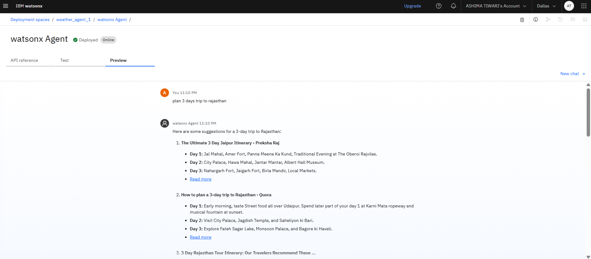
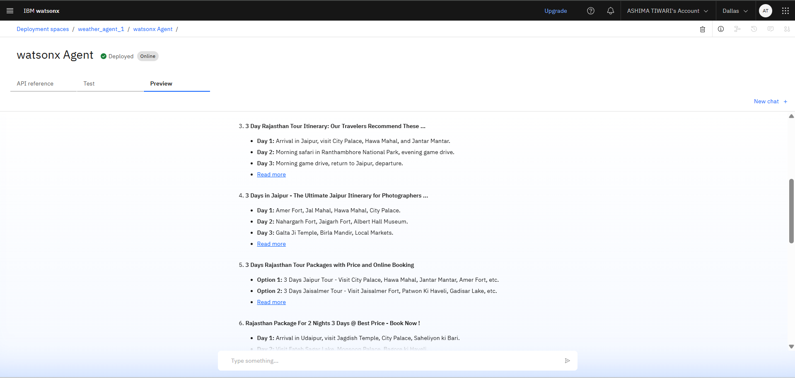

# 🌍 AI-Powered Travel Planner Agent
✨ *This is my internship project at Edunet Foundation under IBM SkillsBuild.*  
🎓 *Capstone Project built using IBM Watsonx & Granite Foundation Models*  
🧠 Generates efficient, real-time, and personalized travel itineraries using natural language input and live data integration.

## 🧩 Problem Statement
Planning a trip involves multiple tasks such as choosing destinations, booking transportation and accommodations, checking weather conditions, and creating day-by-day itineraries. This process can be time-consuming, complex, and overwhelming—especially when travelers must consider personal preferences, budget constraints, and real-time factors like weather and availability.  
There is a need for an intelligent system that can understand user requirements through natural language input, collect relevant real-time data, and generate a personalized and optimized travel plan with minimal user effort.

## 💡 Solution Overview
The AI agent automates travel planning by:
- 🗣️ Accepting natural language inputs
- 🌐 Gathering real-time data on weather, transport, hotels, and maps
- 🧠 Using AI and NLP to generate smart, personalized itineraries
- ✏️ Allowing itinerary regeneration and edits

## ⚙️ How It Works
1. 🧾 User Input – Natural language query  
2. 🔎 Data Collection – Real-time info from APIs (weather, maps, attractions)  
3. 🧠 AI Processing – NLP with Watsonx + Granite  
4. 📋 Output – Structured, day-wise itinerary

## 🔍 Example Workflow
**User Query:**  
*"Plan a 3-day trip to Rajasthan."*

**Agent Understanding:**  
→ Destination: Rajasthan  
→ Duration: 3 days  
→ Context: General travel recommendation

**Agent Response:**  
Returns multiple itinerary suggestions using real-time data and summarization:

### ✨ Itinerary Option 1 – Jaipur
- **Day 1:** Jal Mahal, Amer Fort, Panna Meena Ka Kund, Traditional Evening at The Oberoi Rajvilas  
- **Day 2:** City Palace, Hawa Mahal, Jantar Mantar, Albert Hall Museum  
- **Day 3:** Nahargarh Fort, Jaigarh Fort, Birla Mandir, Local Markets

### ✨ Itinerary Option 2 – Udaipur
- **Day 1:** Jagdish Temple, City Palace, Karni Mata Ropeway  
- **Day 2:** Fateh Sagar Lake, Monsoon Palace, Saheliyon Ki Bari  
- **Day 3:** Bagore ki Haveli, local shopping, musical fountain show

**🔁 Editable Request Example:**  
*"Change the Day 3 activity to only shopping and relaxation."*  
→ Agent will regenerate Day 3 plan with local market visit + spa recommendations.

## 🛠️ Technologies Used
| ⚙️ Tool | 🔍 Purpose |
|--------|------------|
| IBM Cloud Lite | Hosting & integration |
| Watsonx.ai | Agent development & execution |
| Granite LLM | Natural language understanding |
| OpenWeatherMap API | Weather data |
| Google Maps Platform | Maps, routing, POIs |
| Built-in Tools | Search, Summarize, Weather, Calculator |

## 🚀 Features
- 🗣️ Natural language input  
- 📅 Day-wise itinerary generation  
- 🌤️ Weather-aware suggestions  
- 📍 Location-based data integration  
- ✏️ Editable, regenerable results

## 📷 Sample Output

## ✅ Conclusion
This AI-powered agent simplifies trip planning by automating itinerary creation, using real-time and location-aware data, and responding intelligently to user needs. It provides a smooth and personalized experience for travelers.
